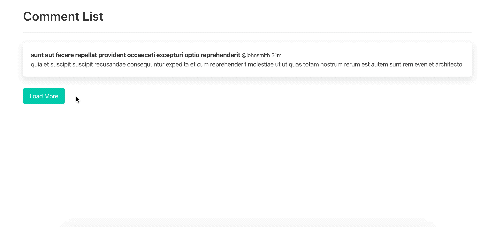

# React/Redux Testing

How to write test in React and Redux.

## 🎨 UI



## 🚀 Quick start

- **Install dependencies**

  ```
  yarn
  ```

- **Run test**

  ```
  yarn test
  ```

- **View your site locally**
  ```
  yarn develop
  ```

## 📝 Changelog

All notable changes to this project will be documented in this file.

The format is based on [Keep a Changelog](https://keepachangelog.com/en/1.0.0/),
and this project adheres to [Semantic Versioning](https://semver.org/spec/v2.0.0.html).

## [1.0.1] - 2020-03-17

### Changed

- Update all dependencies.
- Use `toEqual` instead of snapshot testing for unit testing of `actions`, `reducers` and `store` to keep test code and result in same file.
- Find element instead of snapshot testing to avoid fragile testing.
- Test what user see e.g. find by text and click.
- Add Cypress.
